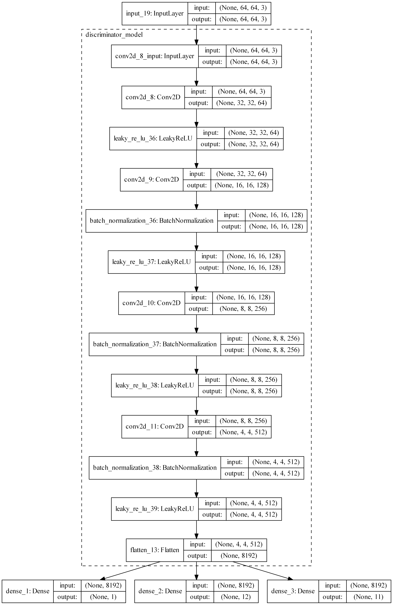

关于该项目的原理，可以参考[GAN网络之入门教程（五）之基于条件cGAN动漫头像生成](https://www.cnblogs.com/xiaohuiduan/p/13791700.html)

关于更多GAN网络的原理，可以参考[GAN网络入门](https://www.cnblogs.com/xiaohuiduan/category/1799415.html)

### 目的

使用条件GAN网络，根据标签生成个性化的图片，如下图所示：

1.  

改变选项后生成图片如下所示：
2.  

### 文件介绍

1. faces 文件夹☞数据集
2. generate 文件夹☞训练过程产生的图片
3. model 文件夹☞训练好的模型
4. main.ipynb ☞ 训练代码 
5. gui.py ☞ gui代码
6. tags_clean.csv 图片标签数据

### G网络模型图：

### D网络模型图:

### gan网络模型图

### 参考

- [Anime-Face-ACGAN](https://github.com/CryoliteZ/Anime-Face-ACGAN)

- [GAN网络入门](https://www.cnblogs.com/xiaohuiduan/category/1799415.html)

